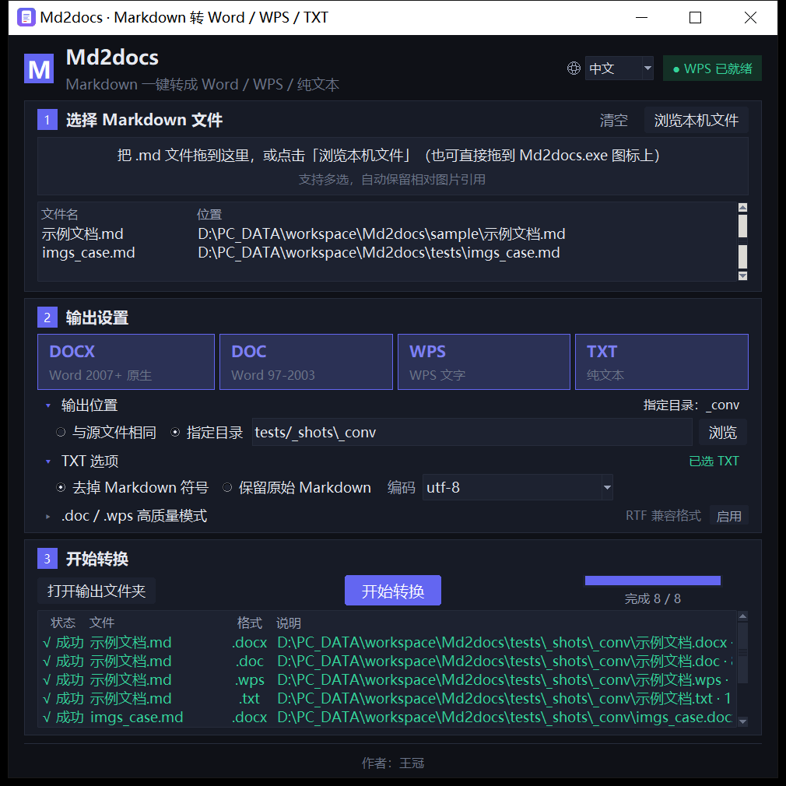
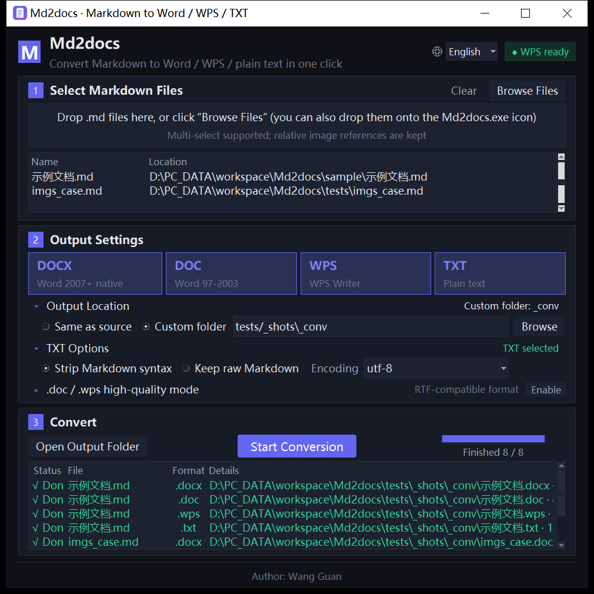

# Md2docs

> 把 Markdown 一键转成 **Word / WPS / 纯文本** 的 Windows 桌面工具。
> 单文件 EXE 分发，双击即用 —— **不安装、不联网、不依赖任何外部运行时**。



<p align="center"><sub>英文界面（标题栏右上角可切换，选择会被记住）</sub></p>



---

## 目录

- [特性](#特性)
- [快速开始](#快速开始)
- [界面用法](#界面用法)
- [命令行用法](#命令行用法)
- [从源码运行](#从源码运行)
- [打包为单文件 EXE](#打包为单文件-exe)
- [项目结构](#项目结构)
- [回归测试](#回归测试)
- [国际化](#国际化)
- [常见问题](#常见问题)
- [许可](#许可)

---

## 特性

| | |
| --- | --- |
| **四种输出格式** | `DOCX`（Word 2007+ 原生）、`DOC`（Word 97-2003）、`WPS`（WPS 文字）、`TXT`（纯文本），可一次勾选多种，批量输出 |
| **零外部依赖** | 纯本地原生桌面程序，**不需要** Python、WebView2、.NET 或浏览器；拷到任何 Windows 机器上双击就能跑 |
| **拖放即用** | 文件可以直接拖进窗口，也可以拖到 `Md2docs.exe` 图标上 |
| **批量与目录** | 支持多选文件；用 `--cli` 时可以直接传一个目录，自动展开其中所有 `.md` / `.markdown` |
| **相对图片自动保留** | 文档里的相对路径图片会被解析并**嵌入**产物，无需手工整理 |
| **中英双语界面** | 默认按操作系统语言自动判定，也可在标题栏右上角手动固定；选择写入 `%APPDATA%\Md2docs\settings.json` |
| **结果可追溯** | 每份产物在结果表里给出「状态 / 文件 / 格式 / 说明」，失败原因直接写明 |
| **可脚本化** | 提供 `--cli` / `--selftest` / `--diag` 三个自动化入口，**出错不弹模态框**、退出码可信 |

### 输出格式说明

| 格式 | 引擎 | 说明 |
| --- | --- | --- |
| `DOCX` | 内置 `python-docx` 写入器 | 生成原生 OOXML，默认字体**微软雅黑** |
| `TXT` | 内置纯文本写入器 | 可选编码 `utf-8` / `utf-8-bom` / `gbk`；可选「保留原始标记」模式 |
| `DOC` / `WPS` | 默认内置 RTF 写入器 | 以 RTF 为载体的兼容格式，Word / WPS / LibreOffice 都能原生打开，**无需本机装 Office** |
| `DOC` / `WPS` | 可选「高质量模式」 | 勾选后调用本机 Word 或 WPS 的 COM 接口重新排版，产物更接近原生；**需要本机装有 Word 或 WPS** |

---

## 快速开始

1. 从 [Releases](../../releases) 下载 `Md2docs.exe`（单文件，约 18 MB）。
2. 双击运行。程序是纯本地工具，**不联网、不写注册表、不装服务**。
3. 把 `.md` 文件拖进窗口 → 勾选输出格式 → 点「开始转换」。

> 首次运行如果被 Windows SmartScreen 拦下，是因为该 EXE 没有代码签名，点「更多信息 → 仍要运行」即可。

---

## 界面用法

界面按三步组织，**单页无滚动**，高级选项收在可折叠区域里。

**第 1 步 · 选择 Markdown 文件**
拖入文件，或点「浏览本机文件」多选；「清空」可一次性移除。文件表里会列出文件名与完整位置。

**第 2 步 · 输出设置**
勾选一种或多种输出格式（`DOCX` / `DOC` / `WPS` / `TXT`）。折叠区展开后可以设置：

- **输出位置** —— 「与源文件相同」或「指定目录」（**严格遵守你的选择，程序不会自行改写输出目录**）
- **TXT 选项** —— 编码与是否保留原始标记（仅在勾选 `TXT` 时可调）
- **`.doc` / `.wps` 高质量模式** —— 是否走本机 Word / WPS 的 COM 接口

**第 3 步 · 开始转换**
点「开始转换」开始，进度条与进度文字实时反馈；完成后可以点「打开输出文件夹」直达产物目录，结果表逐行给出状态与说明。

---

## 命令行用法

自动化入口共用同一套参数，**出错时只写日志与控制台，绝不弹模态框**，并按结果返回退出码。

```bat
Md2docs.exe --cli report.md -f docx
Md2docs.exe --cli .\docs -f docx,txt -o .\out
Md2docs.exe --cli a.md b.md -f wps --native
```

| 参数 | 说明 |
| --- | --- |
| `--cli FILE...` | 命令行转换。参数可以是文件，也可以是目录（目录会被展开为其中所有 `.md` / `.markdown`） |
| `-f, --format` | 输出格式，逗号分隔，可取 `docx` / `doc` / `wps` / `txt`。默认 `docx` |
| `-o, --out` | 输出目录。省略则与源文件同目录 |
| `--native` | `.doc` / `.wps` 走本机 Word / WPS 的 COM 接口（高质量模式） |
| `--txt-mode` | `plain`（默认，纯文本）或 `raw`（保留原始标记） |
| `--txt-encoding` | TXT 编码：`utf-8`（默认）/ `utf-8-bom` / `gbk` |
| `--lang` | 界面语言：`auto`（默认）/ `zh` / `en`。优先级最高，且**不写配置文件** |
| `--selftest` | 界面自检：构造窗口、跑一轮真实转换、逐项断言语义，并做 zh↔en 往返切换 |
| `--diag` | 输出 DPI 与窗口几何度量（排查打包前后的尺寸 / 定位差异） |

**退出码**：全部成功 → `0`；有任何一份失败 → `1`。可以直接用在批处理里：

```bat
Md2docs.exe --cli .\docs -f docx -o .\out || echo 转换失败
```

`--selftest` 与 `--diag` 的结果会打印到控制台，用 ASCII 标记 `OK` / `WARN` / `FAIL`，便于脚本抓取。

---

## 从源码运行

**环境要求**：Windows 10 / 11（64 位）；Python 3.10 及以上（本项目在 **3.14.4** 上开发与验证，自带 tkinter）。

```bat
git clone git@github.com:spotmaverick/md2docx.git
cd md2docx

python -m venv .venv
.venv\Scripts\activate
pip install -r requirements.txt

python src\app.py
```

运行期只依赖四个包：

| 包 | 用途 |
| --- | --- |
| `markdown-it-py` + `mdit-py-plugins` | Markdown 解析（含任务列表插件） |
| `beautifulsoup4` | 内联 HTML 片段的降级处理 |
| `python-docx` | DOCX 写入 |

`--native` 高质量模式额外需要本机装有 **Microsoft Word 或 WPS Office**。程序按注册表里 `LocalServer32` 的实际可执行文件归属来判定，因此**不会把 WPS 误判成 Word**；未检测到时会在界面上明确提示，而不是静默降级。

---

## 打包为单文件 EXE

```bat
pip install -r requirements-dev.txt
pyinstaller Md2docs.build.spec --noconfirm --clean
```

产物为 `dist\Md2docs.exe`（onefile + windowed，约 18 MB）。

> 注意：**打包配置是 `Md2docs.build.spec`**，不是 `Md2docs.spec`。
> 后者是本项目的**需求规格说明书**，两者职责不同（历史上曾同名，已拆分）。
>
> 程序图标在 `assets\app.ico`。不要把它放进 `build\` —— 该目录被 `.gitignore` 忽略，
> 且 `--clean` 会把它清空。

---

## 项目结构

```
md2docx/
├─ src/                     应用源码
│  ├─ app.py                入口：参数解析、CLI、自检、诊断、退出清理
│  ├─ gui.py                全部界面（原生 tkinter），含圆角按钮、地球图标与拖放
│  ├─ i18n.py               中英词条表与语言判定
│  ├─ theme.py              配色与字体
│  ├─ settings.py           设置持久化（%APPDATA%\Md2docs\settings.json）
│  ├─ mdparse.py            Markdown → 内部文档模型
│  ├─ mdmodel.py            内部文档模型（Block / Run）
│  ├─ docx_writer.py        DOCX 写入
│  ├─ rtf_writer.py         RTF 写入（DOC / WPS 的默认载体）
│  ├─ txt_writer.py         TXT 写入
│  ├─ imgsrc.py             图片解析与抓取（相对路径、远程 URL）
│  ├─ com_helper.py         Word / WPS 的 COM 探测与调用
│  └─ convert.py            转换调度：把上面几件拼成一条链路
├─ tools/                   开发与回归工具（见下节）
├─ tests/                   测试固件（样例 Markdown 与图片资源）
├─ sample/                  示例文档
├─ docs/
│  ├─ spec/archive/         需求规格的历史基线快照
│  └─ images/               README 用的界面截图
├─ assets/app.ico           程序图标
├─ Md2docs.spec             需求规格说明书（唯一需求来源）
├─ Md2docs.build.spec       PyInstaller 打包配置
├─ requirements.txt         运行期依赖
└─ requirements-dev.txt     开发 / 打包期依赖
```

> `src\server.py` 与 `src\web\` 是早期「WebView2 + 内置 HTTP 服务」方案的遗留文件，
> 当前架构已不再引用，保留仅为追溯历史，后续会清理。

---

## 回归测试

界面类缺陷（外观、版式、编码、窗口）**不会被功能测试发现**，所以本项目把每一条踩过的坑
都变成了可机械复跑的断言。全部工具都在 `tools\` 下，独立可跑，退出码 `0` 即通过：

```bat
python tools\check_output.py <输出目录> <文件名主干>   :: 产物结构（图片是否真嵌入等）
python tools\check_i18n.py -v                          :: 词条自洽 / 硬编码扫描 / 语言判定 / 双语快照
python tools\check_font_glyphs.py                      :: 每个非 ASCII 字符「字体有字形 且 GBK 可编码」
python tools\check_ui_layout.py                        :: 圆角按钮 +「开始转换」按钮精确居中 + 无重叠
python tools\check_lang_entry.py                       :: 语言入口是自绘地球图标（无文字、无字形），点它可展开并真的切换
python tools\check_fold_fit.py                         :: 折叠区全展开时仍放得下，页脚完整可见
python tools\check_gui_width.py                        :: 真实点击下窗口宽度恒定
python tools\check_no_console_window.py --exe          :: 全程无计划外控制台窗口，且临时目录确实被清理
python tools\check_dnd.py --exe                        :: 拖放边界（构造真实 WM_DROPFILES 投递）
```

几条贯穿全项目的验证纪律：

- **探针必须自带正反对照。** 例如无窗口回归会故意用「有缺陷的创建标志」跑一遍，**正控必须能检出问题**；检不出就判「探针失效」而不是判通过 —— 看不见缺陷的探针给出的假通过，比没有探针更危险。
- **凡涉及编码 / 控制台 / 代码页的验证，必须在干净环境跑。** 开发 shell 里的 `PYTHONUTF8=1` 会掩盖全部编码类缺陷，而打包产物根本不认这两个环境变量，所以两者的结论不能互相推断。
- **量，不要靠通说。** 判断「某个字符在界面上是不是豆腐块」要逐像素比对，而不是查文档下结论。

---

## 国际化

- 全部可见文案收敛在 `src/i18n.py` 的 `STRINGS = {"zh": {...}, "en": {...}}`，**两份必须同增同减**（导入时自检，不一致直接抛错）。`tools/check_i18n.py` 用 AST 静态扫描强制「源码里不得出现硬编码可见文案」。
- 默认语言按系统界面语言判定：主语言为中文 → 中文，**其余一律英文**。判定用的是语言字段而非国家/地区代码，因此 zh-CN / zh-TW / zh-HK / zh-MO / zh-SG 都能正确识别为中文。
- 切换语言**就地刷新、不重建窗口**，已选的文件与格式不会丢。
- **语言入口的标识是自绘地球图标，不是文字。** 界面语言未必等于你的母语，此时「语言 / Language」这段提示本身也是用你看不懂的语言写的——用户要找的正是改语言的地方，却先被这段读不懂的提示挡住。地球图标跨语言通用，点它即可展开列表；列表里的语言名一律用**该语言自己的写法**（`中文` / `English`），所以谁都能认出自己那一项。图标是 Canvas 矢量绘制，不依赖字体字形与编码（`U+1F310` 这类字符在 GBK 与界面字体上都不可靠），也不需要任何图片资源。
- **任何逻辑判断都不得依赖界面文案。** 结果行的 iid 直接对应结果下标，按行取对象 —— 早期代码用 `endswith("成功")` 判断成败，界面一换语言就静默失效。

---

## 常见问题

**Q：需要装 Word 或 WPS 吗？**
不需要。四种格式默认走内置写入器；只有勾选「`.doc` / `.wps` 高质量模式」时才需要本机装有 Word 或 WPS。

**Q：转换出来的文档里，图片是嵌入的还是链接的？**
嵌入。文档里的相对路径图片会被解析并写入产物内部，拷走单个文件即可。

**Q：会不会自动帮我改输出目录或输出格式？**
不会。程序严格遵守你在界面上的选择；**出现冲突时提示，而不是替你改**。

**Q：为什么我的输出目录里有旧文件被覆盖了？**
同名产物默认覆盖。建议为转换结果单独指定一个输出目录。

**Q：拖进去的文件为什么没有生成结果？**
拖入的**文件**不按扩展名过滤（`pic.png` 也会进列表）；只有传入**目录**时才只展开 `.md` / `.markdown`。请检查列表里是否混入了非 Markdown 文件。

**Q：`--selftest` 报了 FAIL 怎么办？**
日志与退出码都会体现。`--selftest` 打印结果行时用的是 ASCII 标记（`OK` / `WARN` / `FAIL`），不受控制台代码页影响，可直接粘进工单。

---

## 许可

本项目以 [Apache License 2.0](LICENSE) 发布。

## 作者

**王冠**
